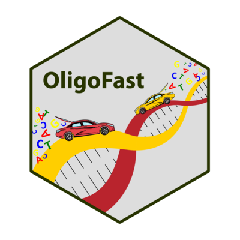

<a name="readme-top"></a>


<!-- PROJECT LOGO -->


# OligoFast R package



Your R companion to design primers couples for various projects!

**This is the first release and Beta-test version of the package.**


The main goal of `OligoFast` package is to provide an easy way to design primers couples in R for various projects.  
It also enables to test the primers couples on datasets and to conduct *in silico* investigations before to move into the laboratory.


## Installation

To install the package `OligoFast` you need `devtools` package on R, then use:

``` r
devtools::install_github("https://github.com/caninuzzo/OligoFast")
```

## Tutorial

The complete package description and tutorial is available <a href="https://caninuzzo.github.io/OligoFast/"><strong>here!</strong></a>


## Citation

If you use `OligoFast` please cite CANINO, A. (2024). R package OligoFast: presentation and pipeline tutorial (0.0.1). Zenodo. [doi:10.5281/zenodo.11001268](https://caninuzzo.github.io/OligoFast/)

<!-- DOI -->
[](https://doi.org/10.5281/zenodo.11001268)
