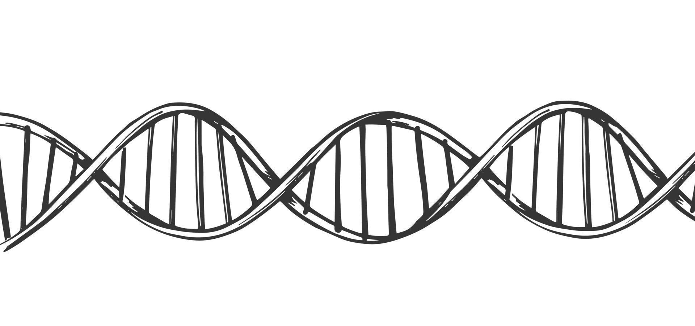

<div style="display:none">
#  {.unnumbered}
</div>


<style>
#TOC {
  border: none; 
  overflow-x: hidden;
}

#TOC li.active {
  font-weight: bold;
  /*color:  #1B6DAB;*/
  color: #273300;
  background-color: white;
}

#TOC > ul > li:first-of-type.active {
  background-color: white;
  font-weight: bold;
  /*color:  #1B6DAB;*/
  color: #273300;
}

#TOC > ul > li:first-of-type {
  font-weight: bold;
}

h1 {
  font-size: 32px; /* Adjust the font size as needed */
  font-weight: bold;
  color: #273300;
}

h2 {
  font-size: 22px; /* Adjust the font size as needed */
  font-weight: 400;
  color: #273300;
}

h3 {
  font-size: 18px; /* Adjust the font size as needed */
  font-weight: 300;
  color: #273300;
}

</style>

  
**Warning:** this is the first release of the package, it may contain bug.s and error.s (I hope few...). Please do not hesitate to [contact me](mailto:alexis.canino13@gmail.com) to report an issue!

---

# Context & Introduction

Designing primers for metabarcoding projects could be challenging, especially when targeting polyphyletic clades or wide diversified taxonomic groups. As an example, designing primers for microalgae -which constitutes a widely diverse clade, including both prokaryotic and eukaryotic organisms- represents a challenging and time-consuming task regarding the high number of sequences and their diversity (without taking into account the choice of the genetic marker). Processing to multiple sequences alignments on such huge datasets requires high computing resources and does not produce accurate alignments to design primers couples.

The package *OligoFast* was built to address this issue in a simple way, it can thus be used to help designing primers couples and test them *in silico* on datasets. You can use it in metabarcoding projects to target -as said previously- wide diversified taxonomic groups but also to target a group of different organisms (such as a group of non-indigenous species for example). You can also use it to test a set of primers couples, their specificity and other characteristics. Before starting a molecular biology project -especially the laboratory part- *in silico* investigations are essential to ensure satisfying results and thus save time and money. This package could constitute an interesting tool for that purpose.

The *OligoFast* ready-to-use pipeline for primers designing will be presented in this tutorial, with complementary functions, to check and test the resulting primers couples.

## How does the pipeline work?

In a few words, the strategy of this pipeline to deal with a big dataset of sequences is to divide it into smaller datasets. This process of subsampling is done randomly and several times (according to the user choice). Each of the subsamples are then aligned independantly. Indeed, since they are composed of less sequences it is easier, faster to align and the results are also more accurate. Afterwards, a detection process of the conserved oligonucleotides is applied on each of the clusters of aligned sequences (and, more precisely, on consensus sequences made for each of them designed according to the user settings). All the oligonucleotides detected are then checked, filtered and compared to each others looking for the most conserved through the datasets and following the parameters set by the user, to fulfill its attempts. 
The different primers couples resulting from the analysis can then be tested in the package to check their predicted amplification abilities (*in silico* PCR), their specificity to target the desired species and other characteristics.


## How to install OligoFast package?

First you need to install the 'devtools' package 
> install.packages('devtools')

Then, run in R:
> devtools::install('')

**Requirements:**  
To work properly, the *OligoFast* package needs the following packages: 
*Biostrings* ; *data.table* ; *dplyr* ; *ggplot2* ; *gtools* ; *msa* ; *plyr* ; *stringr*.


## Overview of the different functions and pipeline steps

The pipeline for primers designing is composed by 6 main functions, which are quickly presented here:

1. Loading the sequences from a FASTA: **loadFASTAasDNA()**
2. Randomly shuffle the sequences, divide them into clusters and align them: **ShuffleAndAlign()**
3. Build consensus sequences from each cluster aligned: **BuildConsensus()**
4. Detect conserved oligonucleotides in each consensus sequences: **OligoFindR()**
5. Keep the most redundant oligonucleotides previously found: **OligoCheckR()**
6. Search for matching primers pairs among the remaining oligonucleotides: **OligoMatchR()**

Complementary to the pipeline, 3 additional functions to check and test the resulting primers couples:

7. Testing a (set of) primers couple(s) on a list of DNA sequences: **OligoTestR()**
8. Perform an *in silico* PCR with a primers couple on a list of DNA sequences: **insilicoPCR()**
9. Testing the specificity of a (set of) primers couple(s) against two DNA sequences lists: **OligoSpecR()**

More...

An additional function has been created to truncate the amplicons: **cutAmplicon()** but it will not be presented in this tutorial.

---

<center>

</center>

---

# Tutorial

The following lines describe the pipeline using default settings (most of the time).  
To store the outputs of the functions (what I recommend to do), you need to create a dedicated directory before starting the pipeline. This won't be done in this example but you can if you want (check the examples section for more details within the help of each function).
It allows to quit the pipeline at any time, and continue it by loading the objects previously produced using 'load' function.

## Training data

Let's discover the pipeline through a fictive study case.
After some people reported box-jellyfishes in the Mediterranean sea, an emergency raised. You were asked to set up a jellyfishes survey on some touristic locations in the Calanques national park in Marseille for the summer season. You decide to establish an eDNA survey using passive sensors fixed on buoys along the study location. It will allow a cost effective, fast and accurate method to detect the species you want to target and even rare or non-indigenous jellyfishes. To start the project you first need to get a genetic marker and a primers couple that fulfill the requirements of the study. Let's say that for this example you choose to investigate on small ribosomal subunit (SSU).

Once this context has been fixed, let's dive deeper into this package and its pipeline.
In the folder 'training_files' you will find two FASTA files created for this example, named "Scyphozoa_and_Cubozoa.fasta" & "SILVA_138.1_SSU_JellyFree.fasta".
The first one gathers 56 SSU sequences belonging to Cubozoa and Scyphozoa class and will be used here as training dataset (its small size allows to discover the pipeline quickly).
The second one is the "SILVA_138.1_SSURef_NR99_tax_silva.fasta.gz" from SILVA<sup>[1]</sup> database [available here](https://www.arb-silva.de/no_cache/download/archive/release_138.1/Exports/) in which the sequences corresponding to the 'wanted' jellyfishes were removed. This last one will allow to test the specifity of the primers couples.

Each of the steps will be detailed in the following lines, you can also find the example in the help() of each functions (*cf*. example section). 

## Designing primers couples

*Nota bene*: for all the functions (except the first one), you can save the outputs by filling `outpath` argument with the path to the folder in which you want to store the outputs. It won't be presented in this tutorial but it is recommended to do it.

### 1. Uploading the FASTA dataset in the R environment

Let's start at the beginning...  
This function enables to load your FASTA dataset from your files to your R environment as a DNAStringSet object (from *Biostrings* package). If RNA sequences (U instead of T wihtin the sequences) are present in your FASTA file, then they will be converted as DNA sequences to match the DNAStringSet requirements.

```
# first load the package and all the others required packages
library(OligoFast, dependencies = TRUE)

JellyDNA <- loadFASTAasDNA(fasta = "path_to/training_file/Cubozoa_and_Scyphozoa.fasta")
```

As an output, the object here called 'JellyDNA' should be in your RStudio Data environment as a DNAStringSet object.

### 2. Randomly shuffle the sequences, divide them into clusters and align them

This function allows to divide randomly your dataset of sequences (`DNAList`, the input DNAStringSet object produced in step 1) in smaller datasets of sequences.
You are able to choose the number of sequences in each clusters using the `nseq` argument (set to 10 by default). 
The number of iterations can also be chosen with the `ite` argument (set as well to 10 by default).
In this example, 56 total sequences using 10 iterations will result in 560 sequences ; divided in 10 clusters, it will result in 56 clusters of 10 sequences.
The multiple sequence alignments is done using the *msa* package (using *msa* function with default parameters).

*Nota bene*: the more iterations you do, the more accurate results you get but the more time it will require to process this function (and the others coming).

```
JellyAlignments <- ShuffleAndAlign(DNAList = JellyDNA, nseq = 10, ite = 10)
```

As an output, you should get the object here called 'JellyAlignments' as a MsaDNAMultipleAlignment object.

### 3. Build consensus from each alignments

From the clusters of aligned sequences, this function allows to build a consensus sequence for each of them. Even if a consensus has already been produced for each clusters by the **msa** function previously runned, this function will create a consensus according to the parameters you defined.
Let's discover them more in details.
The argument `AlignedClust` should be completed with the MsaDNAMultipleAlignment produced in step 2. Regarding the other arguments:  
- `ntThresHi` is the threshold (from 0 to 1) above which a nucleotide will be considered as 'conserved' at a given position in the consensus sequence. With default setting (*i.e.* `ntThresHi = 0.9`), it means that for a given position in the sequences alignment if 9 nucleotides (out of 10) are **A** then the resulting nucleotide for this position will be **A**.   
- `ntThresLo` is the threshold (still from 0 to 1) under which an ambiguous base (**N**) will be set at the given position in the consensus sequence. With default setting (*i.e.* `ntThresLo = 0.3`), it means that for a given position in the sequences alignment if the maximal occurrence of a similar nucleotide is 3 out of the 10 sequences, then the position is considered as ambiguous and **N** is set in the resulting consensus sequence. 
Moreover, this argument plays another role when `ignGap = FALSE` (default, see below): if the occurrence of gaps **-** at the given position is above `ntThresLo`, then the resulting nucleotide in the consensus sequence will be put in lowercase, to indicate then a weakness at this position.  
- `ignGap` this argument is set to FALSE by default and allows to choose if the gaps (**-**) produced in the sequences alignments should be considered or not in the process for building the consensus sequence.  
- `suppData`  this argument is optional and set to FALSE by default. If TRUE, the function returns an additional object with supplementary data about the process (frequency matrixes for each clusters).

Additional explanations:
When the maximum occurrence of a base at a given position is lower than `ntThresHi` but higher than `ntThresLo`, then the sum of the 2 most frequent nucleotides is considered, and compared to `ntThresHi`. If the sum is above the threshold, then an ambiguous base associated to the 2 most frequent nucleotides will be set in the consensus sequence (*e.g.* at a given position there are 4 **A**, 5 **T** and 1 **C** out of the 10 nucleotides, at this position, the base **W** -A & T- will be set in the consensus sequence). If the sum of the 2 most frequent nucleotides is still lower than `ntThresHi`, then the sum of the 3 most frequent nucleotides will be considered. If this sum is above `ntThresHi`, then an ambiguous base associated to the 3 most frequent nucleotides will be set in the consensus sequence (*e.g.* at a given position there are 4 **C**, 3 **T** and 3 **G** out of the 10 nucleotides, at this position, the base **B** -T & C & G- will be set in the consensus sequence). If the sum of 3 nucleotides remains under `ntThresHi`, then the ambigous base **N** will be set at the corresponding position in the consensus sequence.


```
JellyConsensus <- BuildConsensus(AlignedClust = JellyAlignments, ntThresHi = 0.9, ntThresLo = 0.3, ignGap = FALSE, suppData = FALSE)
```

As an output, you should get the object here called 'JellyConsensus' which is a list of consensus sequences.

### 4. Detect conserved oligonucleotides in each consensus sequences

In each consensus sequences previously created, a process of detection will be applied through this function.
During the process, each consensus sequences are analysed from their beginning to their end, looking for oligonucleotides fulfilling the conditions set by the users which are: the oligonucleotides size, the number of degeneresence allowed in the oligonucleotide and the GC content range.
The input object `ConsensusClust` is the list of consensus sequences from step 3. The other arguments are:  
- `PriMin` (mandatory, set to 18 by default) the minimum size (in bp) expected for the primers.  
- `PriMax` (mandatory, set to 22 by default) the maximum size (in bp) expected for the primers.  
- `maxDeg` (mandatory, set to 2 by default) the maximum of degenerescence allowed for the primers.   
<small>*The degenerescence score of W -which is A or T- is 2 ; the one of B -which can be T or C or G- is 3 ; N is 4 etc.*</small>  
- `GCRange` (mandatory, set to c(40,60) by default) the range (in %) of GC content within the primers.  

Feel free to change the default settings of the parameters to match with your attempts, you can find different guidelines for optimal primers characteristics.  
*Nota bene*: this package does not take into account any biochemical characteristics of the oligonucleotides (such as tridimensionnal structure, foldings, hybridizations, melting temperatures *etc.*). Those ones are essential in the designing of your primers and I recommend you to check them with another tool at the end of the pipeline (where more details about it will be presented).

```
JellyOligoFound <- OligoFindR(ConsensusClust = JellyConsensus, PriMin = 18, PriMax = 22, maxDeg = 0, GCrange = c(40,60))
```

As an output, you should get the object here called 'JellyOligoFound' which is a dataframe containing the oligonucleotides fulfilling the given parameters and kept from each clusters.

### 5. Keep the most redundant oligonucleotides previously found

This function gathers all oligonucleotides from the previous step and, thanks to the dataframe created in step 4, checks the most redundant oligonucleotides found through the different clusters.
The threshold `nOcc` represents the number of times the oligonucleotide is found through all the different clusters. By setting a numeric value to it, this enables to keep only the oligonucleotides above this one.
The input object for this function is thus 'JellyOligoFound' which should be the output from **OligoFindR()** function.  
Then the different arguments are:  
- `filtGaps` (mandatory, default: TRUE) if TRUE, the oligonucleotides with gaps are removed from the analysis.  
- `nOcc` (mandatory) the number of times the oligonucleotide is found through the different consensus sequences. The theorical maximum is the total number of clusters (meaning the oligonucleotide is found in each cluster and thus well conserved). The higher `nOcc` is, the more reliable the oligonucleotides are for matching to the sequences. The maximum value for `nOcc` is the total number of consensus sequences (in this example, you can check it with *length(JellyConsensus)* ).  
- `plot` (optional, default: TRUE) if TRUE, it creates an overview of the most abundant oligonucleotides and their estimated position over the sequences on a graph, using *ggplot2*. The picture is a new object named 'oligOverview' (print(oligOverview) to display it).

*Nota bene*: In this example, `nOcc` has been set to its maximal value: 56. Indeed, in this case we have many oligonucleotides over this threshold, but in other cases, with more numerous and/or diversified sequences it won't be the case and you will have to play with the different arguments. 

```
JellyOligoChecked <- OligoCheckR(OligoFound = JellyOligoFound, filtGaps = TRUE, nOcc = 56, plot = TRUE)
```

As an output, you should get the object here called 'JellyOligoChecked' which is also a dataframe containing the oligonucleotides kept after this process.

### 6. Search for matching primers pairs among the remaining oligonucleotides

The goal of this sixth function is to create all possible combinations of the oligonucleotides previously gathered and to check if some of those couples fulfill the user conditions to constitute potential primers pairs able to produce amplicons with suitable size to a particular sequencing technology (or other purposes...).
The input object is thus 'JellyOligoChecked' which should be the output from **OligoCheckR()** function. Then the different arguments are:  
- `ampSize` (mandatory) a numeric vector is expected, with the minimum and maximum size range expected for the amplicons. Example: `ampSize = c(300,500)` to select amplicon from 300pb to 500pb (the primers are included in the size!). In this case, this size allows using MiSeq sequencing (2x250bp or 2x300bp kits) with a wide range (to avoid being too much restrictive).  
- `target` (optional) a numeric vector is expected, if you want to look for primers couples only in a particular region within the sequences. You should indicate the values as a numeric vector. Example: c(800,1200) to target ONLY a variable region located around 800 and 1200bp).  
- `GCtail` (mandatory, default: TRUE) if TRUE then the oligonucleotides presenting 3 or more G, C (and other bases corresponding) on their last nucleotides at the 3' tail will be removed from the analysis. It helps the polymerase to break away more easily after each elongation cycles.  

Due to the potential high number of combinations to test, this function could require some time to process.

```
JellyOligoMatched <- OligoMatchR(OligoChecked = JellyOligoChecked, ampSize = c(300,500), GCtail = TRUE)
```

As an output, you should get the object here called 'JellyOligoMatched' another dataframe containing the matching oligonucleotides couples with the given parameters. In this one, all the oligonucleotides are given in the 5'->3' orientation.


---


## Testing primers couples

After carrying out the pipeline from step 1 to 6, a list of potential primers couples fulfilling all the user conditions has been established. If this list is empty (or some functions within the previous pipeline led to empty objects), then you should consider to adapt your parameters to be less restrictive in your primers research. However, there are no magic formula and in some cases the design of primers can be really challenging or even impossible.
Well, in this example it is not the case and after running step 6 we should get plenty of primers couples. Let's check them using the following functions.

### 7. Testing a (set of) primers couple(s) on a list of DNA sequences

The current function is determinant for the primers couples selection, especially when dealing with a big set of potential primers couples (as in this example). It can also be used to test a single primers couple. The function performs different *in silico* PCRs with different levels of mismatches according to the user settings. Then the oligonucleotides couples are sorted for their ability to match the given sequences and to get the best resolution.
The first argument `DNAList` should thus be your dataset of sequences, loaded in R in step 1 using **loadFASTAasDNA** function.
The argument `PrimersCouples` in this example will be the output from **OligoMatchR** function which gathers the primers couples found. It can also be a simple vector such as c("FORWARD","REVERSE") if you want to use the function to test only one couple.
The argument `mmCalc`, set to 2 by default, is the number of mismatches used in the primers scoring calculation and for the amplicon resolution showed.

```
OligoTestR(DNAList = JellyDNA, PrimersCouples = JellyOligoMatched, mmCalc = 2)
```

Two objects will stem from this function:  
- 'OligoResults': in this dataframe the primers couples are sorted according to (and in this order of priority) the amplicon resolution and the number of sequences matching exactly (0 mismatch forward and reverse) with the primers couples. Other characteristics relative to the amplification process are also provided in the dataframe.  
- 'OligoTested' in this one, the primers couples (not sorted) are given as well as their mean size and locations in the sequences.

*Nota bene*: the amplicon resolution is the number of **different** amplicons resulting from the amplification. It means that, if after the amplification process 2 different sequences lead to the same amplicon, then the resolution will be 1/2 since the produced amplicons cannot be distinguished.

### 8. Perform an *in silico* PCR with a primers couple on a list of DNA sequences

This function aims to return the amplicon sequences resulting from the *in silico* amplification process using a given primers couple.
The first argument `DNAList` should thus be your dataset of sequences, loaded in R in step 1 using **loadFASTAasDNA** function.
Each oligonucleotide should be provided for the corresponding argument: `forward` and `reverse`.
Additionally, `targetReg` can be specified as a numeric range (vector) to target a specific region in the sequences.

```
insilicoPCR(DNAList = JellyDNA, forward = JellyOligoMatched$Forward, reverse = JellyOligoMatched$Reverse, maxdiffF = 2, maxdiffR = 2)
```
As an output of the function, 4 different objects are produced:    
-'PCROut': a dataframe that gives details about the amplification of each sequences.     
-'amplified': a DNAStringSet object that gathers the amplicons from the *in silico* amplification.  
-'non-resolutive-amplicon': a DNAStringSet object that gathers the 'non-resolutive' amplicons from the *in silico* amplification.   
-'not-amplified' a DNAStringSet object that gathers the sequences not amplified in the process.  

### 9. Testing the specificity of a (set of) primers couple(s) against two DNA sequences lists

This function allows to test the specificity of the given primers couples to a dataset against another.
To do so, you need to provide for `primersCouples` argument a list of primers obtained from either the function **OligoMatchR** or **OligoTestR**. If you just want to test one primers couple, you can give a vector of character with your oligonucleotides such as c("FORWARD","REVERSE").  
The `TargetSeq` argument stands for the sequences you want to amplify (*i.e.* in this example the initial dataset that we are using from step 1: 'JellyDNA').  
The `AvoidSeq` argument should be completed with a dataset of sequences (same genetic marker) that we don't want to amplify. For this example, a dataset has been created and put in training_files folder: "SILVA_138.1_SSU_JellyFree.fasta". Basically, it's the dataset from SILVA 138.1 SSU excluding the jellyfishes sequences used in this example.  
Finally the `mmCalc` argument, set to 2 by default, is the number of mismatches used in the *in silico* amplification process.

In this example, to get a quicker overview of the function, we will use only the 10 first primers couples obtained from OligoTestR function:

```
# first upload the FASTA file corresponding to AvoidSeq argument
JellyFree <- loadFASTAasDNA(fasta = "path_to/training_file/SILVA_138.1_SSU_JellyFree.fasta")
# then run the function
OligoSpecR(primersCouples = OligoResults[1:10,], TargetSeq = JellyDNA, AvoidSeq = JellyFree, mmCalc = 2)
```

As an output, the dataframe 'OligoSpecResults' sums up the number of sequences amplified in the dataset containing the target sequences and the number of sequences amplified in the dataset in which we want to avoid the amplification of sequences.
A ratio is calculated from these two fields, which gives the specificity score:   
<small>(number of targets amplified/total number of targets)/(number of unwanted sequences amplified/total number of unwanted sequences)</small>.  
Higher is the specificity score, higher is the specificity of the primers couple to the target sequences, nonetheless this score has to be compared with the other ratios to optimize the primers couples selection.

**Reminder:** the primers couples obtained following this pipeline were designed only according to computational methods. Indeed the primers couples designed with the given parameters show an ability to produce amplicons but it remains theorical, based only on this *in silico* investigation. As we know, and experiment often, the gap between theory and practice can be huge, especially in the field of molecular biology. Moreover, as said previously, the functions used for primers designing and *in silico* PCR are only based on characters recognition. The biochemical characteristics are not taken into account in this package (to date), and I recommend using the online tool [OligoAnalyser](https://eu.idtdna.com/pages/tools/oligoanalyzer)<sup>[2]</sup> to test your final primers couples. The tool is easy to use and provides all the informations you need before to order your primers.

---

<center>

</center>

---

<center>I hope this package will help you in your current or future projects!</center> 


---

<small>
Author: Alexis CANINO  
  
Logo design: Yousra ALAOUI
</small>  
Bibliography:  
[1] Quast C, Pruesse E, Yilmaz P, Gerken J, Schweer T, Yarza P, Peplies J, Glöckner FO (2013) The SILVA ribosomal RNA gene database project: improved data processing and web-based tools.   
[2] Owczarzy, Richard, et al. "IDT SciTools: a suite for analysis and design of nucleic acid oligomers." Nucleic acids research36.suppl_2 (2008): W163-W169
